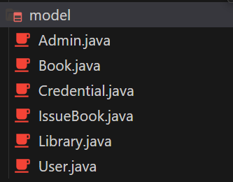
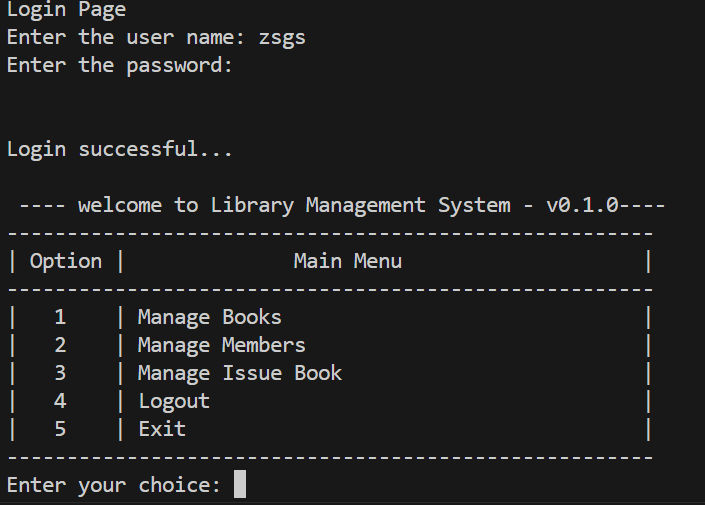
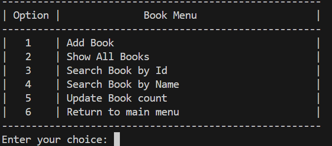
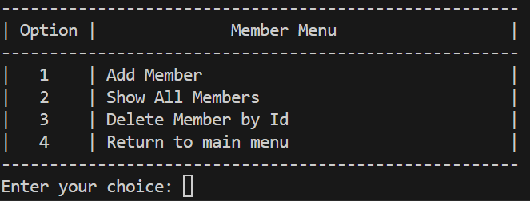
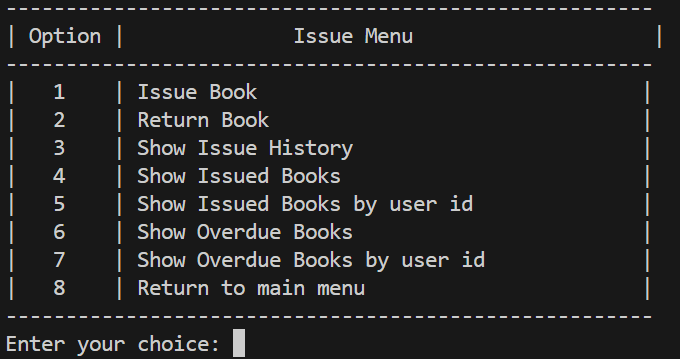

# Library Management System
This project is a simple implementation of a Library Management System. It provides functionalities such as managing books, managing library members, issuing and returning books, and tracking book issuing history and overdue books.

## Components

HomePage: This class serves as the entry point of the application. It displays the main menu options and handles user inputs to navigate through different functionalities.

ManageBookView: Manages operations related to books such as adding new books, displaying all books, searching books by ID or name, and updating book count.

UserView: Handles operations related to library members such as adding new members, displaying all members, and removing members by ID.

IssueBookView: Manages book issuing and returning functionalities. It also provides features to display issue history, currently issued books, overdue books, and overdue books by user ID.

LoginView: Manages user authentication and login functionality.

## Usage

Run the application.

You will be prompted with a login screen. Enter your credentials to log in.

After logging in, you will be presented with the main menu.

Choose an option from the menu to perform the desired operation.

Follow the on-screen prompts to complete the chosen operation.

You can logout by selecting the "Logout" option from the main menu, or exit the application by selecting the "Exit" option.
## Dependencies

This project requires the Gson library for handling JSON data. You can download the Gson jar file from here and include it in your project's classpath.

## Model Class

## Homepage - Admin Login

## Manage Books Menu

## Manage Members Menu

## Manage IssueBooks
