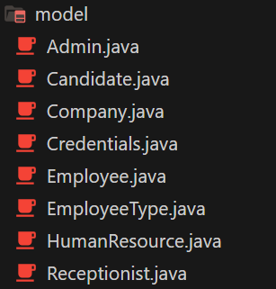
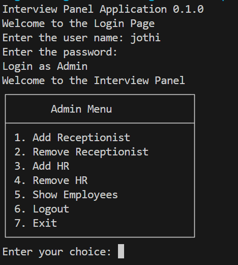
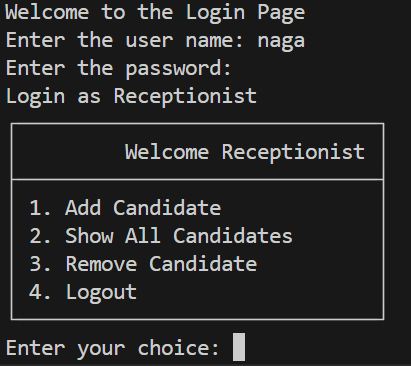
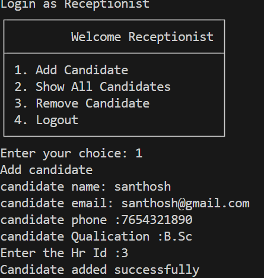
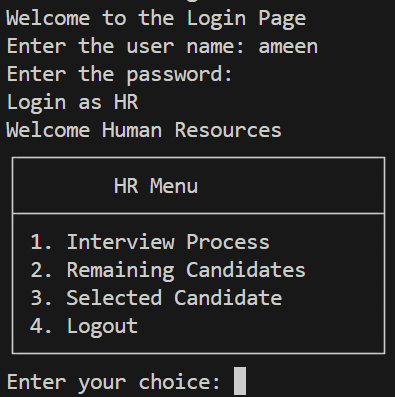
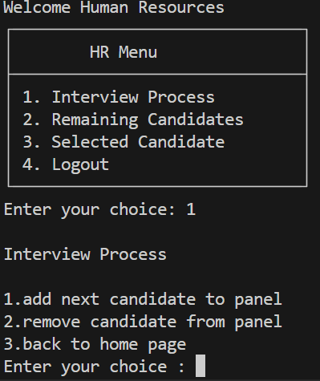

# Interview Panel Home Page

This project represents the home page functionality for an interview panel system. It provides menus and options for different user roles such as Admin, Receptionist, and Human Resources.

## Overview

The `HomePage` class serves as the central hub for navigating the interview panel system. It offers distinct menus tailored to each user role, facilitating seamless interaction with the system's functionalities.

## Features

- **Admin View**: Admin users can manage receptionists and human resources, view employees, and perform administrative tasks.
- **Receptionist View**: Receptionist users can add, view, and remove candidates, simplifying candidate management.
- **Human Resources View**: Human Resources users can manage the interview process, view remaining and selected candidates, and perform related tasks.

## Dependencies

This project requires the Gson library for handling JSON data. You can download the Gson jar file from here and include it in your project's classpath.

## Usage

1. **Run the Application**: Import the project into your IDE and run the application.
2. **Navigate Menus**: Upon launching, users are presented with menus corresponding to their roles.
3. **Interact**: Users can select options from the menus to perform various tasks within the interview panel system.
4. **Logout or Exit**: Users can logout to return to the login screen or exit the application as needed.

## Model Class

## Admin Login

## Receptionist Login

## Candidate Added By Receptionist

## HumanResource Login

## InterviewProcess By Hr
